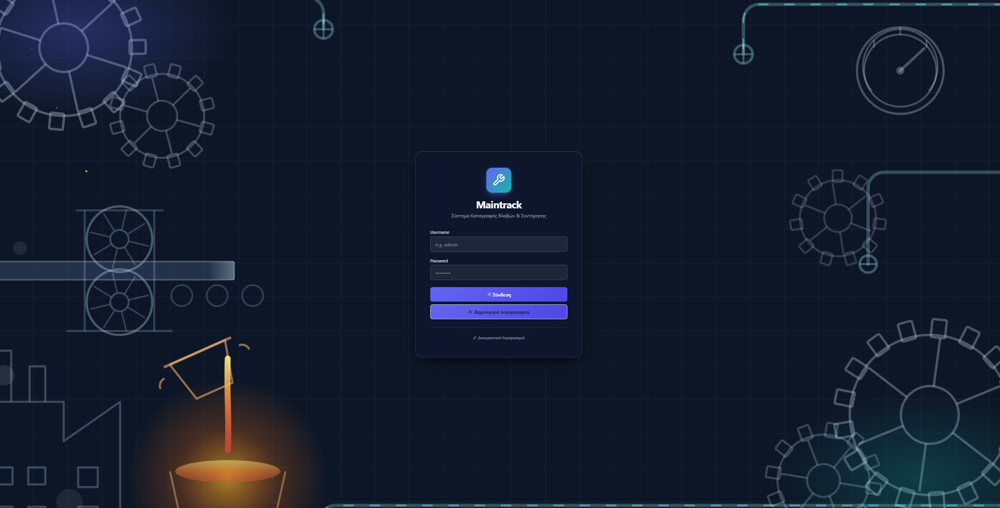
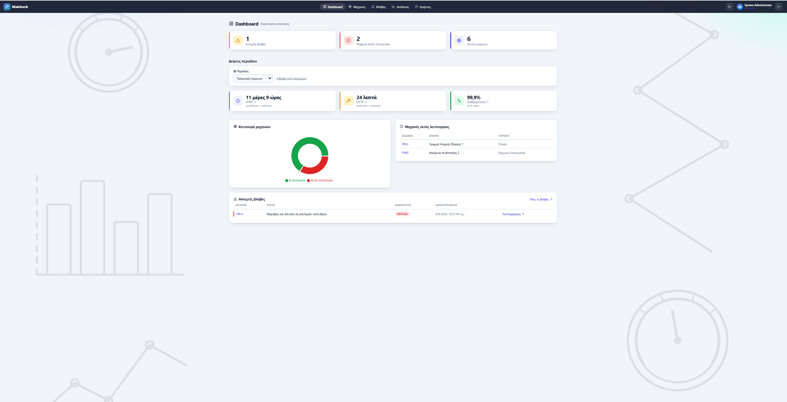
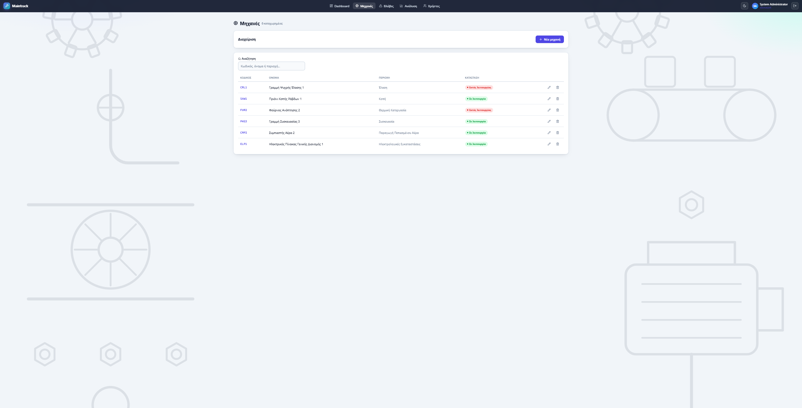
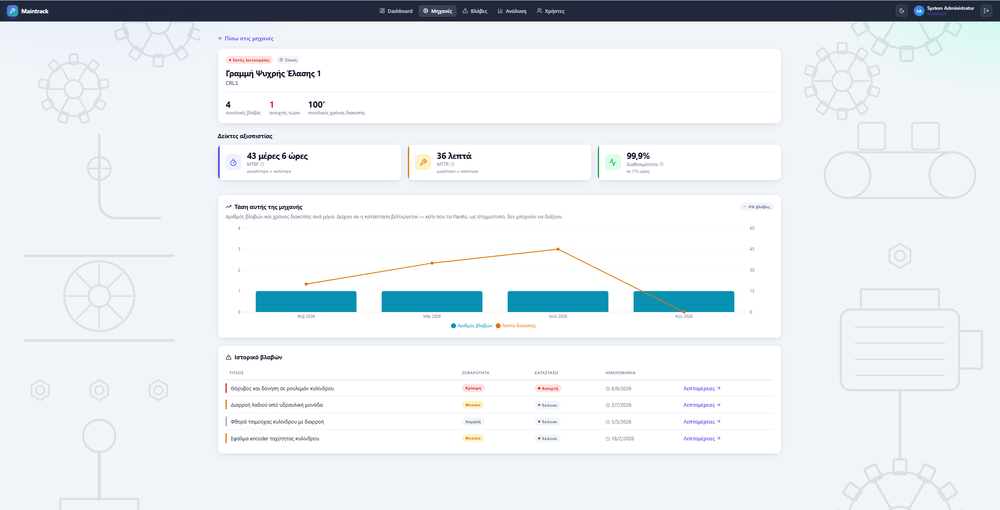
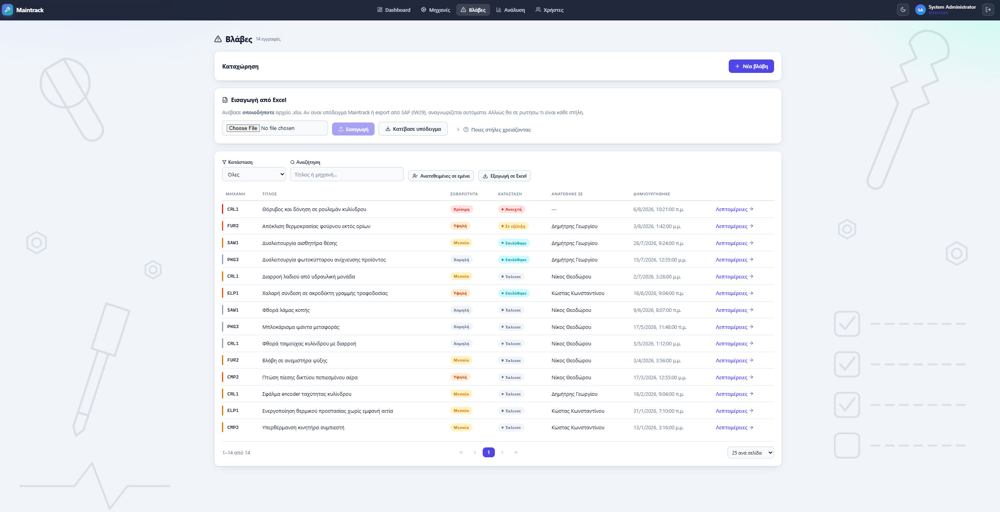
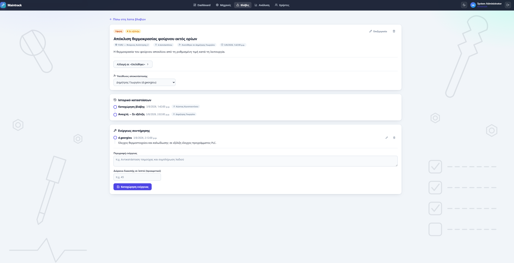
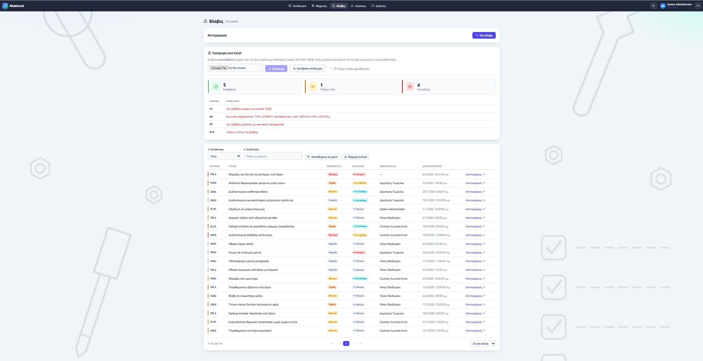
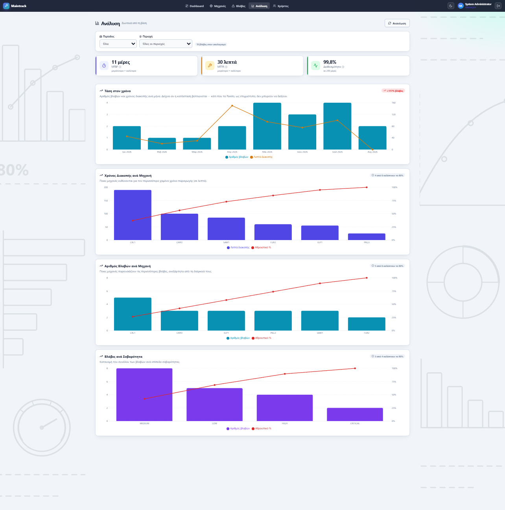
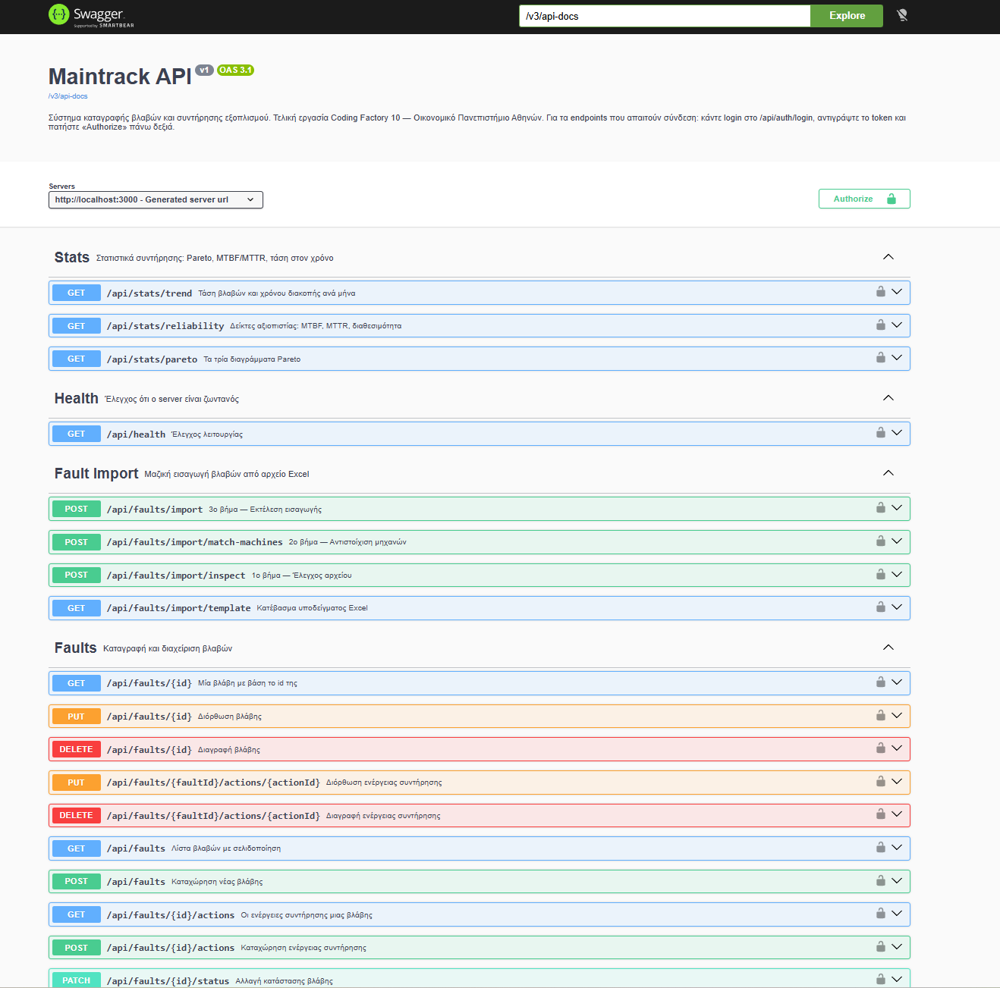

# MainTrack

Το MainTrack είναι μια web εφαρμογή για την καταγραφή και παρακολούθηση βλαβών και ενεργειών συντήρησης σε βιομηχανικό εξοπλισμό.

Η ιδέα του project είναι να συγκεντρώνει σε ένα σημείο τις μηχανές, τις βλάβες τους, τις ενέργειες που έγιναν, τον τεχνικό που έχει αναλάβει κάθε περίπτωση και βασικά στοιχεία για την πορεία της συντήρησης. Πάνω σε αυτά τα δεδομένα υπολογίζονται δείκτες όπως MTBF, MTTR και Availability, ενώ υπάρχουν επίσης trend και Pareto αναλύσεις.

Το project αναπτύχθηκε ως τελική εργασία του Coding Factory 10 του Οικονομικού Πανεπιστημίου Αθηνών.

Όλα τα δεδομένα επίδειξης που υπάρχουν στην εφαρμογή είναι φανταστικά.

## Μια πρώτη εικόνα

Η εφαρμογή ξεκινά με login και, μετά τη σύνδεση, ο χρήστης οδηγείται στο Dashboard.



Στο Dashboard εμφανίζονται συνοπτικά οι ανοιχτές βλάβες, η κατάσταση των μηχανών και οι βασικοί δείκτες της επιλεγμένης περιόδου.



## Τι μπορεί να κάνει η εφαρμογή

Το MainTrack καλύπτει τα βασικά βήματα μιας απλής διαδικασίας συντήρησης:

* καταχώρηση και διαχείριση μηχανών,
* δημιουργία και επεξεργασία βλαβών,
* κατηγοριοποίηση βλάβης με επίπεδο σοβαρότητας,
* ανάθεση βλάβης σε τεχνικό,
* καταγραφή ενεργειών συντήρησης και χρόνου διακοπής,
* ιστορικό αλλαγών κατάστασης,
* αναζήτηση και φίλτρα,
* εισαγωγή και εξαγωγή Excel,
* διαχείριση χρηστών και ρόλων,
* MTBF, MTTR και Availability,
* trend βλαβών και χρόνου διακοπής,
* Pareto αναλύσεις.

Η βασική ροή κατάστασης μιας βλάβης είναι:

```
OPEN → IN_PROGRESS → RESOLVED → CLOSED
```

Δεν επιτρέπεται να κλείσει μια βλάβη αν δεν έχει προηγουμένως περάσει σε `RESOLVED`, ενώ κάθε αλλαγή κατάστασης αποθηκεύεται στο ιστορικό της.

## Μηχανές

Κάθε μηχανή έχει κωδικό, όνομα, λειτουργική περιοχή και κατάσταση.

Η κατάσταση της μηχανής ενημερώνεται αυτόματα από τις ανοιχτές βλάβες της: αν υπάρχει ανοιχτή βλάβη σοβαρότητας `HIGH` ή `CRITICAL` η μηχανή περνά σε `DOWN`, αν υπάρχει οποιαδήποτε άλλη ανοιχτή βλάβη περνά σε `UNDER_MAINTENANCE`, και όταν δεν μένει καμία ανοιχτή επιστρέφει σε `OPERATIONAL`.

Από τη λίστα μηχανών ο χρήστης μπορεί να ανοίξει τη σελίδα μιας συγκεκριμένης μηχανής και να δει αναλυτικά τα στοιχεία της.



Στη σελίδα της μηχανής εμφανίζονται οι δείκτες MTBF, MTTR και Availability, η τάση στον χρόνο και το ιστορικό των βλαβών που σχετίζονται με αυτή.



## Βλάβες και ενέργειες συντήρησης

Σε κάθε βλάβη καταγράφονται η μηχανή, ο τίτλος, η περιγραφή, η σοβαρότητα και η τρέχουσα κατάσταση.

Τα επίπεδα σοβαρότητας είναι:

`LOW`, `MEDIUM`, `HIGH`, `CRITICAL`

Η λίστα βλαβών υποστηρίζει φίλτρα, αναζήτηση και σελιδοποίηση, ώστε να μπορεί ο χρήστης να βρίσκει εύκολα συγκεκριμένες καταγραφές.



Μια βλάβη μπορεί να ανατεθεί σε τεχνικό και να έχει μία ή περισσότερες ενέργειες συντήρησης. Σε κάθε ενέργεια μπορεί να καταγραφεί και χρόνος διακοπής. Η πρώτη ενέργεια που καταχωρείται σε μια βλάβη που είναι ακόμα `OPEN` την περνά αυτόματα σε `IN_PROGRESS`.

Στην αναλυτική σελίδα της βλάβης εμφανίζονται επίσης ο υπεύθυνος τεχνικός, οι ενέργειες που έχουν γίνει και το ιστορικό των αλλαγών κατάστασης.



## Χρήστες και ρόλοι

Η εφαρμογή χρησιμοποιεί τρεις ρόλους:

* `TECHNICIAN`
* `SUPERVISOR`
* `MANAGER`

Ο `TECHNICIAN` μπορεί να εργάζεται πάνω στις βλάβες και να αναλαμβάνει μια διαθέσιμη βλάβη για τον εαυτό του.

Ο `SUPERVISOR` έχει επιπλέον δικαιώματα, όπως δημιουργία και επεξεργασία μηχανών, ανάθεση βλαβών σε άλλους χρήστες, Excel import και διαχείριση χρηστών χαμηλότερου ρόλου.

Ο `MANAGER` έχει τα περισσότερα δικαιώματα, μεταξύ άλλων διαγραφή μηχανών ή βλαβών και ευρύτερη διαχείριση χρηστών.

Ο κανόνας ιεραρχίας είναι ότι κάθε χρήστης μπορεί να δημιουργήσει ή να αναθέσει μόνο ρόλο χαμηλότερο από τον δικό του. Κανείς δεν μπορεί να δημιουργήσει άλλον `MANAGER` μέσω του API.

Η δημόσια εγγραφή δημιουργεί πάντα ανενεργό λογαριασμό `TECHNICIAN`. Ο λογαριασμός πρέπει να ενεργοποιηθεί πριν μπορέσει ο χρήστης να συνδεθεί.

## Excel import / export

Η εφαρμογή υποστηρίζει εισαγωγή βλαβών από αρχεία `.xlsx`.

Μπορεί να αναγνωρίσει:

* το template του MainTrack,
* export από SAP IW29,
* άγνωστη μορφή αρχείου, όπου ο χρήστης αντιστοιχίζει τις στήλες στα πεδία της εφαρμογής.

Αν τα ονόματα των μηχανών στο Excel δεν ταιριάζουν ακριβώς με αυτά της βάσης, εμφανίζεται επιπλέον βήμα αντιστοίχισης. Οι προτάσεις δεν εφαρμόζονται ποτέ αυτόματα και δύο ονόματα με διαφορετικό αριθμό δεν θεωρούνται ποτέ ίδια μηχανή.

Η εισαγωγή δεν σταματά ολόκληρη από μία προβληματική γραμμή. Στο τέλος επιστρέφεται αναφορά για τις επιτυχημένες εγγραφές, τις διπλοεγγραφές και τις γραμμές που απέτυχαν.



Το template του MainTrack περιλαμβάνει προαιρετική στήλη ημερομηνίας, ώστε ιστορικά δεδομένα να διατηρούν την πραγματική τους ημερομηνία και να μην καταγράφονται όλα ως σημερινά.

Υπάρχει επίσης export της λίστας βλαβών σε `.xlsx`, με βάση τα φίλτρα που έχει επιλέξει ο χρήστης.

Στον φάκελο `samples/` υπάρχουν αρχεία επίδειξης για δοκιμή του import.

## Analytics

Οι δείκτες υπολογίζονται από τα δεδομένα της βάσης και όχι από στατικά ή προϋπολογισμένα στοιχεία.

Το MainTrack εμφανίζει:

* MTBF (Mean Time Between Failures)
* MTTR (Mean Time To Repair)
* Availability
* αριθμό βλαβών ανά μήνα,
* χρόνο διακοπής ανά μήνα,
* Pareto χρόνου διακοπής ανά μηχανή,
* Pareto αριθμού βλαβών ανά μηχανή,
* Pareto βλαβών ανά σοβαρότητα.

Υπάρχουν φίλτρα περιόδου και λειτουργικής περιοχής, ενώ στη σελίδα μιας συγκεκριμένης μηχανής οι δείκτες υπολογίζονται μόνο για εκείνη.



Οι βασικοί υπολογισμοί που χρησιμοποιούνται είναι:

```
MTBF (ώρες) =
(ημέρες περιόδου × 24) / πλήθος βλαβών
```

```
MTTR (ώρες) =
(συνολικά λεπτά διακοπής / 60)
/
πλήθος βλαβών με καταγεγραμμένο χρόνο διακοπής
```

```
Availability (%) =
100 × MTBF / (MTBF + MTTR)
```

Στον MTTR μετρώνται μόνο οι βλάβες που έχουν καταγεγραμμένο χρόνο διακοπής. Οι υπόλοιπες θα τραβούσαν τον μέσο όρο προς τα κάτω και θα έδιναν εικόνα γρηγορότερων επισκευών από την πραγματική. Όταν δεν υπάρχουν αρκετά δεδομένα, οι δείκτες επιστρέφονται κενοί και όχι μηδενικοί.

Τα φίλτρα εφαρμόζονται στην ημερομηνία της βλάβης και όχι της επισκευής, ώστε μια βλάβη του Δεκεμβρίου που επισκευάστηκε τον Ιανουάριο να μη μετρά σε λάθος μήνα.

Το αρχείο `Maintrack-Pareto.pbix` αποτελεί συμπληρωματικό Power BI dashboard και δεν απαιτείται για τη λειτουργία της εφαρμογής.

## Τεχνολογίες

**Backend**

* Java 21
* Spring Boot 3.5.16
* Spring Web
* Spring Data JPA / Hibernate
* Spring Security
* JWT (`jjwt` 0.13.0)
* Microsoft SQL Server JDBC
* Apache POI 5.4.1
* springdoc-openapi / Swagger
* Maven

**Frontend**

* React 18
* Vite 5
* React Router
* Axios
* Recharts
* Lucide React
* React Hot Toast

**Βάση και deployment**

* Microsoft SQL Server 2022
* Docker
* Docker Compose
* Nginx
* Node 20 στο Docker build του frontend
* Java 21 / Temurin στο backend

Στο backend η εφαρμογή είναι χωρισμένη σε `Controller`, `Service` και `Repository` layers. Τα δεδομένα που ανταλλάσσονται μέσω του API χρησιμοποιούν DTOs και τα JPA entities δεν εκτίθενται απευθείας.

## Δομή του repository

```
maintrack-app/
├── backend/            Spring Boot εφαρμογή, Dockerfile, Maven wrapper
│   └── src/
│       ├── main/java/com/codingfactory/maintrack/
│       │   ├── config/       DataSeeder, OpenApiConfig
│       │   ├── controller/   REST endpoints
│       │   ├── dto/          Request / Response objects
│       │   ├── exception/    Κεντρικός χειρισμός σφαλμάτων
│       │   ├── model/        JPA entities και enums
│       │   ├── repository/   Spring Data JPA
│       │   ├── security/     JWT, SecurityConfig
│       │   └── service/      Επιχειρησιακή λογική
│       └── test/             Unit tests
├── frontend/           React + Vite, Dockerfile, nginx.conf
│   └── src/
│       ├── api/        Κλήσεις προς το backend
│       ├── components/ Επαναχρησιμοποιήσιμα components
│       ├── context/    Auth και Theme
│       └── pages/      Σελίδες της εφαρμογής
├── docker/             Script αρχικοποίησης της βάσης
├── docs/screenshots/   Εικόνες του README
├── postman/            Postman collection
├── samples/            Αρχεία Excel για δοκιμή του import
├── docker-compose.yml
└── .env.example
```

## Build και Deployment

Ο προτεινόμενος τρόπος εκτέλεσης της εφαρμογής είναι μέσω Docker Compose, ώστε να μην χρειάζεται ξεχωριστή εγκατάσταση SQL Server, Maven ή Node.js για την πλήρη εκτέλεση.

Το μόνο που απαιτείται είναι εγκατεστημένο Docker Desktop ή Docker Engine με το plugin `compose`.

### 1. Clone του repository

```
git clone https://github.com/geokal1996/maintrack-app.git
cd maintrack-app
```

### 2. Δημιουργία του `.env`

Το repository περιλαμβάνει αρχείο `.env.example`.

Σε Windows PowerShell:

```
Copy-Item .env.example .env
```

Σε Linux / macOS:

```
cp .env.example .env
```

Στο `.env` πρέπει να υπάρχει τιμή για το `JWT_SECRET`. Χωρίς αυτήν το Docker Compose σταματά με σχετικό μήνυμα. Οι υπόλοιπες μεταβλητές έχουν προεπιλεγμένες τιμές στο `docker-compose.yml`.

Το πραγματικό `.env` βρίσκεται στο `.gitignore` και δεν ανεβαίνει στο repository.

### 3. Build και εκκίνηση

Από τη ρίζα του project:

```
docker compose up -d --build
```

Με αυτή την εντολή ξεκινούν:

* ο SQL Server,
* το initialization της βάσης,
* το Spring Boot backend,
* το React frontend μέσω Nginx.

Το πρώτο build χρειάζεται αρκετά λεπτά, καθώς κατεβαίνουν οι εικόνες και οι εξαρτήσεις.

Η εφαρμογή είναι διαθέσιμη στο:

```
http://localhost:3000
```

Το backend είναι διαθέσιμο στο:

```
http://localhost:8080
```

### 4. Τερματισμός

```
docker compose down
```

Αν θέλουμε να διαγραφούν και τα δεδομένα της Docker βάσης:

```
docker compose down -v
```

Με νέο `docker compose up -d --build` δημιουργείται ξανά καθαρή βάση και φορτώνονται τα demo δεδομένα.

## Τοπικό build / development

Η ανάπτυξη του project έγινε σε Windows.

Για τοπική εκτέλεση χωρίς Docker χρειάζονται JDK 21, Node.js και ένας SQL Server με βάση `maintrackdb`. Εναλλακτικά, μπορεί να χρησιμοποιηθεί μόνο η βάση από το Docker:

```
docker compose up -d sqlserver db-init
```

Πριν την εκκίνηση του backend πρέπει να οριστούν οι μεταβλητές περιβάλλοντος `DB_URL`, `DB_USERNAME`, `DB_PASSWORD` και `JWT_SECRET`, καθώς οι δύο τελευταίες δεν έχουν προεπιλεγμένη τιμή.

Το backend σε Docker και το τοπικό backend χρησιμοποιούν και τα δύο τη θύρα `8080` και δεν μπορούν να τρέχουν ταυτόχρονα.

### Backend

Build:

```
cd backend
.\mvnw.cmd clean package
```

Tests:

```
.\mvnw.cmd test
```

Το jar παράγεται στον φάκελο:

```
backend/target/
```

Σε Linux ή macOS οι αντίστοιχες εντολές είναι `./mvnw clean package` και `./mvnw test`.

### Frontend

```
cd frontend
npm.cmd install
npm.cmd run build
```

Τα production αρχεία δημιουργούνται στο:

```
frontend/dist/
```

Για development:

```
npm.cmd run dev
```

Το Vite dev server ανοίγει στο:

```
http://localhost:5173
```

Σε Linux ή macOS χρησιμοποιείται `npm` αντί για `npm.cmd`.

## Demo λογαριασμοί

Για γρήγορη δοκιμή της εφαρμογής υπάρχουν οι παρακάτω demo χρήστες.

**Manager**

```
Username: admin
Password: Admin123!
```

**Supervisor**

```
Username: m.nikolaou
Password: Manager123!
```

**Technician**

```
Username: k.konstantinou
Password: Tech123!
```

Υπάρχουν επίσης οι demo technicians:

```
d.georgiou / Tech123!
n.theodorou / Tech123!
```

Οι χρήστες δημιουργούνται αυτόματα από τον `DataSeeder` σε άδεια βάση. Ο λογαριασμός `admin` δημιουργείται μόνο όταν η βάση δεν έχει κανέναν χρήστη.

Μαζί με τους χρήστες δημιουργούνται έξι μηχανές και δεκατέσσερις βλάβες, κατανεμημένες σε διάστημα περίπου οκτώ μηνών, ώστε τα φίλτρα περιόδου και οι αναλύσεις να έχουν πραγματικά δεδομένα να δείξουν.

## Swagger / REST API

Το REST API τεκμηριώνεται με Swagger / OpenAPI.

Με Docker το Swagger UI είναι διαθέσιμο στο:

```
http://localhost:3000/swagger-ui.html
```

και απευθείας από το backend στο:

```
http://localhost:8080/swagger-ui.html
```

Το OpenAPI JSON βρίσκεται στο:

```
http://localhost:8080/v3/api-docs
```

Το Swagger και το `GET /api/health` είναι δημόσια και δεν απαιτούν σύνδεση. Για τα υπόλοιπα endpoints γίνεται πρώτα login μέσω `POST /api/auth/login`. Στη συνέχεια το JWT token μπορεί να δοθεί από το κουμπί Authorize του Swagger.



Τα βασικά API groups είναι:

* Authentication
* Machines
* Faults
* Maintenance Actions
* Fault Import / Export
* Statistics
* Users
* Health

## Tests

Το backend περιλαμβάνει unit tests με JUnit 5, Mockito και AssertJ.

Το τελευταίο test run ολοκληρώθηκε με:

```
42 tests
0 failures
0 errors
```

Τα tests καλύπτουν μεταξύ άλλων:

* κανόνες αλλαγής κατάστασης βλάβης,
* αυτόματη αλλαγή κατάστασης μηχανής,
* ανάθεση βλάβης,
* ιστορικό καταστάσεων,
* MTBF / MTTR / Availability,
* Pareto και trend,
* αντιστοίχιση μηχανών κατά το Excel import,
* αναγνώριση στηλών Excel,
* ιεραρχία ρόλων,
* αλλαγή κωδικού χρήστη,
* maintenance actions.

Τα automated tests αφορούν κυρίως το service layer του backend. Δεν εκτελούνται κατά το Docker build· τρέχουν ξεχωριστά με `.\mvnw.cmd test`.

## Postman

Στο repository υπάρχει Postman collection:

```
postman/Maintrack.postman_collection.json
```

Περιλαμβάνει 39 requests για τα βασικά endpoints της εφαρμογής, αλλά και αρνητικά σενάρια για έλεγχο των HTTP status `401`, `403`, `404` και `409`.

Για χρήση:

1. γίνεται import το collection στο Postman,
2. εκτελείται πρώτα η ομάδα `Auth`,
3. τα scripts αποθηκεύουν αυτόματα τα tokens και τα IDs που χρειάζονται τα επόμενα requests.

## Configuration

Οι βασικές μεταβλητές περιβάλλοντος του backend είναι:

```
DB_URL
DB_USERNAME
DB_PASSWORD
JWT_SECRET
```

Τα `DB_URL` και `DB_USERNAME` έχουν προεπιλεγμένες τιμές για τοπικό SQL Server. Τα `DB_PASSWORD` και `JWT_SECRET` δεν έχουν και πρέπει να δοθούν.

Για το Docker Compose χρησιμοποιούνται επίσης τα στοιχεία σύνδεσης του SQL Server μέσα από το `.env`.

Στο frontend χρησιμοποιείται:

```
VITE_API_BASE_URL
```

Στο Docker build παίρνει τιμή `/`, επειδή το Nginx λειτουργεί ως reverse proxy για το backend.

## Security και χειρισμός σφαλμάτων

Η αυθεντικοποίηση είναι stateless και βασίζεται σε JWT.

Οι κωδικοί αποθηκεύονται με BCrypt και τα δικαιώματα εφαρμόζονται τόσο από το Spring Security όσο και από το service layer, όπου απαιτούνται πιο συγκεκριμένοι κανόνες.

Ο ρόλος κατά την εγγραφή ορίζεται από τον server και δεν μπορεί να δηλωθεί από το αίτημα.

Η εφαρμογή χρησιμοποιεί validation στα DTOs και επιστρέφει ανά περίπτωση HTTP status όπως:

```
400 Bad Request
401 Unauthorized
403 Forbidden
404 Not Found
409 Conflict
```

Το μήνυμα σε αποτυχημένη σύνδεση είναι σκόπιμα γενικό, ώστε να μην αποκαλύπτεται ποια usernames υπάρχουν.

Το frontend διαθέτει επίσης δική του σελίδα 404.

Τα JWT έχουν διάρκεια 24 ωρών.

## Περιορισμοί της τρέχουσας έκδοσης

Το MainTrack είναι εκπαιδευτικό project και όχι production σύστημα.

Στην τρέχουσα έκδοση:

* δεν υπάρχει διαδικασία ανάκτησης ξεχασμένου κωδικού,
* δεν υπάρχει server-side token revocation, οπότε μετά την αποσύνδεση το token παραμένει τεχνικά έγκυρο μέχρι να λήξει,
* δεν υπάρχει περιορισμός στις προσπάθειες σύνδεσης,
* το database schema ενημερώνεται με Hibernate `ddl-auto=update` και όχι με migrations,
* τα automated tests καλύπτουν κυρίως το backend service layer και δεν υπάρχουν automated frontend tests.

## Συγγραφέας

Γεώργιος Καλοκαιρινός

Τελική εργασία — Coding Factory 10
Οικονομικό Πανεπιστήμιο Αθηνών

Repository:
https://github.com/geokal1996/maintrack-app
